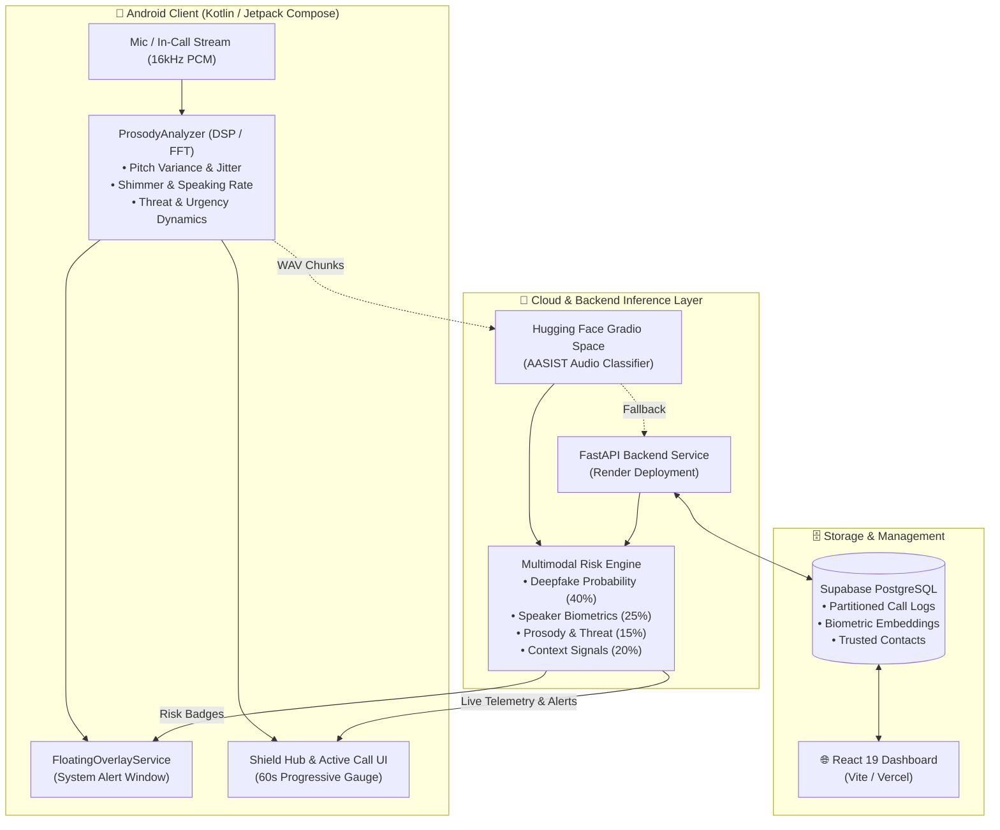

<p align="center">
  
</p>

<h1 align="center">VoiceShield</h1>

<p align="center">
  <b>Real-time AI-powered voice deepfake detection, scam threat mitigation & call security platform</b>
</p>

<p align="center">
  
  
  
  
  
  
  
  
  
</p>

---

## 📖 Overview

**VoiceShield** is an end-to-end, multi-layered security ecosystem engineered to defend individuals and enterprises against voice-based deepfake attacks, synthetic speech impersonation, and social engineering telephone fraud in real time.

By coupling ultra-low-latency on-device Digital Signal Processing (DSP) prosody analysis with deep neural anti-spoofing models (AASIST), cloud Gradio inference, and an Android floating call overlay, VoiceShield delivers instantaneous risk telemetry during ongoing phone and VoIP conversations.

### Key Capabilities

- 🛡️ **AASIST Deepfake Audio Detection** — Spectro-temporal graph attention network (AASIST / AASIST-L) detecting synthetic speech, vocoder artifacts, and voice conversion with state-of-the-art accuracy.
- ⚡ **On-Device Hybrid Prosody & Threat Engine** — DSP engine analyzing pitch volatility, vocal jitter, shimmer, speaking cadence, and social engineering urgency/threat dynamics (e.g., intimidation yelling, rushed scam cadence).
- ⏱️ **60-Second Progressive Verification Window** — Real-time continuous analysis window with rolling risk indicators, nominal human baseline calibration (12–18%), suspicious pressure warnings (28–50%), and verified completion badges.
- ☁️ **Hugging Face Gradio Cloud & Resilient Fallback** — Seamless cloud verification via Hugging Face Gradio API with automatic fallback to FastAPI backend and localized on-device DSP.
- 🫧 **Floating Call Protection Overlay** — Android `SYSTEM_ALERT_WINDOW` floating widget displaying live risk scores, acoustic statuses, and threat badges over any active third-party call.
- 📞 **WebRTC In-Call Audio Engine** — Custom WebRTC calling engine with fine-grained earpiece/speaker routing, bidirectional audio streaming, and live threat telemetry.
- 👥 **Biometric Speaker Verification** — Cosine similarity matching against enrolled voice prints to prevent caller ID spoofing and identity theft.
- 📊 **Multimodal Risk Scoring** — Blended risk framework combining deepfake probabilities, biometric voice matching, prosody anomalies, and conversational context into an actionable 0–100 risk score.
- 📈 **React 19 Security Dashboard** — Responsive web console for reviewing call histories, threat trends, managing trusted contacts, and monitoring enrolled biometric profiles.

---

## 🏗️ Architecture & Data Flow



---

## 📁 Repository Structure

```
voice-shield/
├── aasist/                  # 🧠 AI/ML Engine — AASIST Deepfake Detection
│   ├── models/              # Model architectures (AASIST, AASIST-L, RawNet2, RawGAT-ST)
│   ├── config/              # Training, evaluation & inference configurations
│   ├── inference.py         # Standalone audio file inference CLI
│   ├── main.py              # PyTorch training & evaluation pipeline
│   └── requirements.txt
│
├── backend/                 # ⚡ FastAPI Backend — REST API & Risk Evaluation
│   ├── app/
│   │   ├── api/             # Routes: /auth, /calls, /analysis, /users, /contacts
│   │   ├── models/          # Pydantic schemas & request/response contracts
│   │   └── services/        # Business logic, Supabase client, risk scoring
│   ├── supabase_schema.sql  # Database schema with user-partitioned tables
│   └── requirements.txt
│
├── frontend/                # 🌐 React 19 Web App — Threat Analytics & Admin Dashboard
│   ├── src/
│   │   ├── pages/           # Dashboard, Active Call, Contacts, Settings, Analytics
│   │   ├── components/      # Reusable UI widgets, charts & gauges
│   │   ├── context/         # Auth & Call State context providers
│   │   └── services/        # API integration layer
│   └── package.json
│
├── app/                     # 📱 Android Application — Kotlin + Jetpack Compose
│   └── src/main/java/com/sagar/voice_shield/
│       ├── data/            # Room DB, Retrofit API, Gradio client, Repositories
│       ├── ml/              # On-device ProsodyAnalyzer & RiskEngine
│       ├── service/         # AudioAnalysisService, FloatingOverlayService, AudioCallEngine
│       ├── ui/              # Compose screens (ShieldHub, ActiveCall, SpeakerProtection)
│       └── notification/    # High-priority foreground notifications & alerts
│
├── models/                  # 🗂️ Pretrained weights & model artifacts
├── logo.jpeg                # Project emblem
└── build.gradle.kts         # Root Gradle build configuration
```

---

## 🎯 Threat Detection & Scoring Model

VoiceShield evaluates calls across multiple vectors to produce an accurate, calibrated risk score from **12 to 100**:

$$\text{Risk} = \Big(0.40 \cdot P_{\text{deepfake}} + 0.25 \cdot (1 - S_{\text{speaker}}) + 0.15 \cdot P_{\text{prosody}} + 0.20 \cdot C_{\text{context}}\Big) \times 100$$

### Score Tiers & Calibrated Baselines

| Score Range | Severity | Status | Description & User Action |
|:---:|:---:|:---:|---|
| **12 – 27** | `LOW` | 🟢 Verified Safe | Genuine human vocal tract verified; baseline accommodates mobile codec compression (AMR-WB/Opus). |
| **28 – 51** | `MEDIUM` | 🟠 Suspicious | Acoustic anomalies detected: robotic cadence, severe pitch flattening, or aggressive urgency. |
| **52 – 100** | `HIGH` | 🔴 Critical Threat | Synthetic vocoder signature confirmed, severe biometric mismatch, or active impersonation scam. |

### Acoustic DSP Metrics Analyzed On-Device

- **Pitch Variance & Jitter**: Identifies synthetic flat pitch patterns ($\sigma_p < 35\text{ Hz}$) and micro-frequency instability.
- **Vocal Shimmer**: Detects synthetic vocoder amplitude distortion vs. natural voice perturbations.
- **Speaking Rate**: Measures syllable peak cadence per second to catch rush-intimidation tactics ($> 4.8\text{ syll/s}$).
- **Energy / Amplitude Spikes**: Flags shouting, threats, and acoustic intimidation tactics ($A_{\text{peak}} > 0.60$).

---

## 🚀 Getting Started

### Prerequisites

| Layer | System Requirements |
|---|---|
| **Python** | Python 3.10+, PyTorch ≥ 1.6, `ffmpeg` / `libsndfile` |
| **Backend** | Python 3.10+, Supabase account & project |
| **Frontend** | Node.js 18+ (Node 20+ recommended), npm / pnpm |
| **Android** | Android Studio Ladybug+, JDK 17, Android SDK 36 (minSdk 26) |

---

### 1. Repository Setup

```bash
git clone https://github.com/ShauriyaDeveloper1/voice-shield.git
cd voice-shield
```

### 2. AASIST ML Engine

```bash
cd aasist
python -m venv venv
# Windows:
venv\Scripts\activate
# Linux/macOS:
source venv/bin/activate

pip install -r requirements.txt
```

**Run standalone audio classification:**
```bash
python inference.py --audio sample_test.wav
```

**Train or evaluate model:**
```bash
# Training
python main.py --config ./config/AASIST.conf

# Evaluation
python main.py --eval --config ./config/AASIST.conf
```

### 3. FastAPI Backend Server

```bash
cd ../backend
python -m venv venv
# Windows:
venv\Scripts\activate
# Linux/macOS:
source venv/bin/activate

pip install -r requirements.txt
```

**Configure `.env`:**
```bash
cp .env.example .env
```
Edit `.env` with your credentials:
```env
SUPABASE_URL=https://your-project.supabase.co
SUPABASE_ANON_KEY=your-supabase-anon-key
SECRET_KEY=your-secret-encryption-key
```

**Database Setup:**
Execute `supabase_schema.sql` within your Supabase SQL Editor to initialize all partitioned tables, triggers, and Row Level Security policies.

**Run the API server:**
```bash
uvicorn app.main:app --host 0.0.0.0 --port 8000 --reload
```
API docs available at `http://localhost:8000/docs`.

### 4. React 19 Frontend Dashboard

```bash
cd ../frontend
npm install
npm run dev
```
Access the dashboard at `http://localhost:5173`.

### 5. Android Companion Application

1. Open `voice-shield` in **Android Studio**.
2. Synchronize Gradle project files.
3. Grant necessary runtime permissions upon launch:
   - **Microphone** (`android.permission.RECORD_AUDIO`) — In-call audio stream capture.
   - **Display over other apps** (`android.permission.SYSTEM_ALERT_WINDOW`) — Floating call protection bubble.
   - **Notifications** (`android.permission.POST_NOTIFICATIONS`) — Real-time threat alerts.
4. Run on a physical Android device or emulator running API 26+.

---

## 🔌 API Reference

| Method | Endpoint | Description | Auth Required |
|:---:|---|---|:---:|
| `GET` | `/` | Health check & service ping | No |
| `GET` | `/health` | Detailed service & model status | No |
| `POST` | `/api/auth/register` | Register new user account | No |
| `POST` | `/api/auth/login` | Authenticate user & return JWT | No |
| `GET` | `/api/calls/` | List authenticated user's call logs | Yes |
| `POST` | `/api/calls/` | Create call entry & attach risk scores | Yes |
| `POST` | `/api/analysis/` | Upload audio chunk for deepfake analysis | Yes |
| `GET` | `/api/users/` | Fetch authenticated profile details | Yes |
| `GET` | `/api/contacts/` | Retrieve verified trusted contacts | Yes |
| `POST` | `/api/contacts/` | Enroll trusted contact & voice print | Yes |

---

## 🗄️ Database Architecture

VoiceShield utilizes **Supabase (PostgreSQL)** featuring automatic per-user table partitioning for high-throughput isolation:

| Table | Purpose |
|---|---|
| `profiles` | User profiles, phone numbers, security roles, and device tokens. |
| `trusted_contacts` | Partitioned contact records with verified identity flags. |
| `speaker_profiles` | Biometric voice embedding vectors (192-d / 512-d). |
| `calls` | Complete call logs including duration, risk severity, and metadata. |
| `call_analysis` | Fine-grained scores: deepfake prob, speaker similarity, prosody, and context. |
| `alerts` | Incident logs with actionable recommendations and notifications. |

---

## 🧠 AI Model Benchmarks

| Model Architecture | Parameters | EER (Equal Error Rate) | min t-DCF | Primary Use Case |
|---|:---:|:---:|:---:|---|
| **AASIST** | ~300K | **0.83%** | **0.0275** | Primary Spectro-Temporal Model |
| **AASIST-L** | 85K | **0.99%** | **0.0309** | Lightweight High-Throughput Model |
| **RawNet2** | Baseline | 4.80% | 0.1145 | Raw Waveform Feature Baseline |
| **RawGAT-ST** | Baseline | 1.06% | 0.0335 | Graph Attention Baseline |

*Trained and validated on the [ASVspoof 2019 Logical Access (LA)](https://www.asvspoof.org/index2019.html) dataset.*

---

## 🌐 Production Deployments

- **Frontend Application**: Hosted on [Vercel](https://vercel.com) with Single Page Application rewrites.
- **Backend Services**: Hosted on [Render](https://render.com) (`https://voice-shield-backend-7xpl.onrender.com/`).
- **ML Cloud Inference**: Hosted on [Hugging Face Spaces](https://huggingface.co/spaces) with Gradio endpoints.

---

## 🤝 Contributing

Contributions are welcome! Please follow these steps:

1. Fork the repository
2. Create a dedicated branch: `git checkout -b feature/voice-enhancement`
3. Commit your changes: `git commit -m 'feat: add enhanced prosody jitter extraction'`
4. Push to the branch: `git push origin feature/voice-enhancement`
5. Submit a descriptive Pull Request

---

## 📄 License

The core VoiceShield application is licensed under the [MIT License](LICENSE).  
The AASIST model architecture and baseline components are subject to NAVER Corp. MIT licensing terms.

---

<p align="center">
  <b>Built with ❤️ by the VoiceShield Team</b>
</p>
