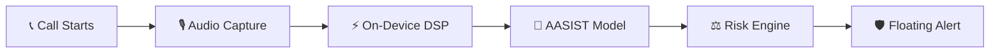

<p align="center">
  
</p>

<h1 align="center">VoiceShield</h1>

<p align="center">
  <b>Real-time AI voice deepfake detection & call security platform</b>
</p>

<p align="center">
  
  
  
  
  
  
  
</p>

---

## 📖 Overview

**VoiceShield** protects users in real time from voice deepfake attacks, synthetic speech impersonation, and phone fraud. It combines ultra-low latency on-device acoustic DSP, AASIST graph neural networks, and an Android floating call overlay to deliver live threat telemetry during phone calls.

### Key Features

- 🛡️ **AASIST Deepfake Detection**: Graph neural network classifying audio as authentic or synthetic.
- ⚡ **On-Device Prosody & Threat DSP**: Sub-second extraction of pitch jitter, shimmer, and scammer urgency dynamics.
- ⏱️ **60s Verification Window**: Progressive in-call evaluation with calibrated human safety baselines (12–18%).
- 🫧 **Floating Call Overlay**: Real-time risk badge floating over phone or VoIP calling apps.
- 👥 **Speaker Verification**: Biometric voice matching against enrolled trusted contacts.
- 📊 **Multimodal Risk Scoring**: Blends deepfake probability, voice similarity, and acoustic urgency (0–100).
- 📈 **React 19 Web Dashboard**: Live call logs, analytics, and contact management.

---

## 🔄 How It Works



1. **Call Monitoring**: Foreground service activates on call start and mounts the floating overlay.
2. **Audio Streaming**: In-memory 16 kHz PCM chunks (~3s) are captured with zero unencrypted disk storage.
3. **Local DSP Analysis**: Instantly checks pitch variance, jitter, shimmer, and aggressive speech cadence.
4. **Deepfake Inference**: AASIST model evaluates synthetic audio likelihood via cloud/local API.
5. **Multimodal Risk Scoring**: Combines deepfake (40%), biometrics (25%), prosody/threat (15%), and context (20%).
6. **Live Telemetry & Alerts**: Displays real-time risk scores on the overlay and triggers instant alerts if threats are detected.

---

## 🎯 Risk Tiers

$$\text{Risk} = \Big(0.40 \cdot P_{\text{deepfake}} + 0.25 \cdot (1 - S_{\text{speaker}}) + 0.15 \cdot P_{\text{prosody}} + 0.20 \cdot C_{\text{context}}\Big) \times 100$$

| Score | Severity | Status | Description |
|:---:|:---:|:---:|---|
| **12 – 27** | `LOW` | 🟢 Safe | Verified natural human voice (calibrated for ambient & mobile codec noise). |
| **28 – 51** | `MEDIUM` | 🟠 Suspicious | Robotic cadence, pitch flattening, or aggressive urgency detected. |
| **52 – 100** | `HIGH` | 🔴 Threat | Synthetic voice clone or active scam detected. Immediate alert issued. |

---

## 📁 Repository Structure

```
voice-shield/
├── aasist/       # 🧠 AASIST deepfake detection models & inference pipeline
├── backend/      # ⚡ FastAPI REST API & multimodal risk engine
├── frontend/     # 🌐 React 19 + Vite analytics web dashboard
├── app/          # 📱 Android Kotlin app (Jetpack Compose, DSP analyzer, Floating Overlay)
└── models/       # 🗂️ Model weights & configurations
```

---

## 🚀 Quick Start

### 1. Backend (FastAPI)
```bash
cd backend
python -m venv venv && source venv/bin/activate   # Windows: venv\Scripts\activate
pip install -r requirements.txt
cp .env.example .env                             # Add Supabase credentials
uvicorn app.main:app --reload
```
API runs at `http://localhost:8000` (Docs: `http://localhost:8000/docs`).

### 2. Frontend (React 19)
```bash
cd frontend
npm install
npm run dev
```
Dashboard runs at `http://localhost:5173`.

### 3. Android App
1. Open repository root in **Android Studio** (JDK 17, minSdk 26).
2. Sync Gradle and run on device/emulator.
3. Grant **Microphone** and **Display over other apps** permissions.

### 4. AASIST Inference (CLI)
```bash
cd aasist
python inference.py --audio sample_test.wav
```

---

## 🔌 API Endpoints

| Method | Endpoint | Description |
|:---:|---|---|
| `GET` | `/health` | Service & model health check |
| `POST` | `/api/auth/login` | User authentication & JWT |
| `POST` | `/api/analysis/` | Submit audio chunk for deepfake analysis |
| `GET` | `/api/calls/` | Retrieve call records & threat scores |
| `GET` | `/api/contacts/` | List verified trusted contacts |

---

## 🌐 Deployments

- **Frontend**: Hosted on [Vercel](https://vercel.com)
- **Backend**: Hosted on [Render](https://voice-shield-backend-7xpl.onrender.com/)
- **ML Space**: Hosted on [Hugging Face Spaces](https://huggingface.co/spaces)

---

## 📄 License

MIT License © 2026 VoiceShield Team. AASIST model architecture © NAVER Corp.
